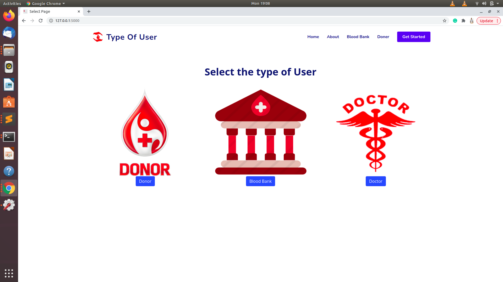
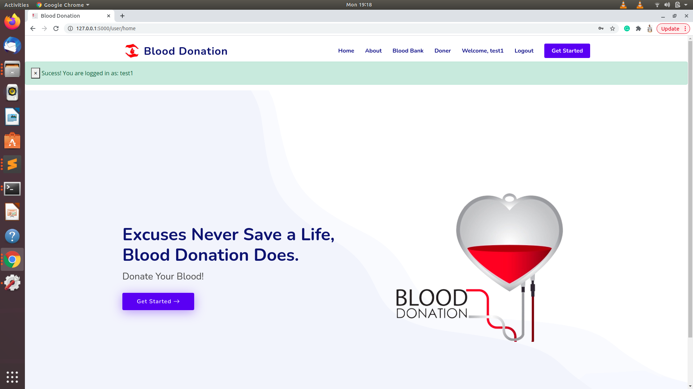
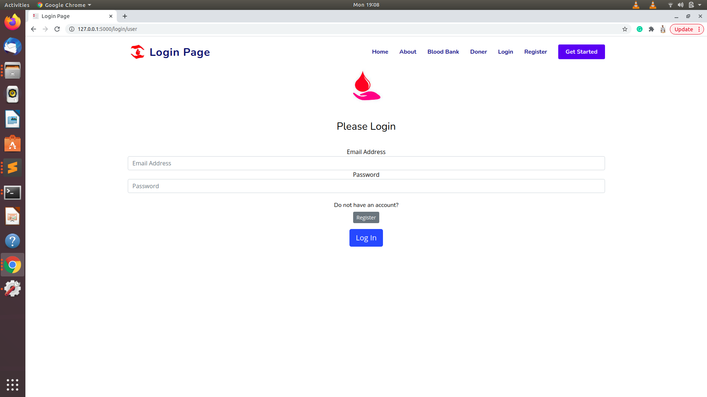
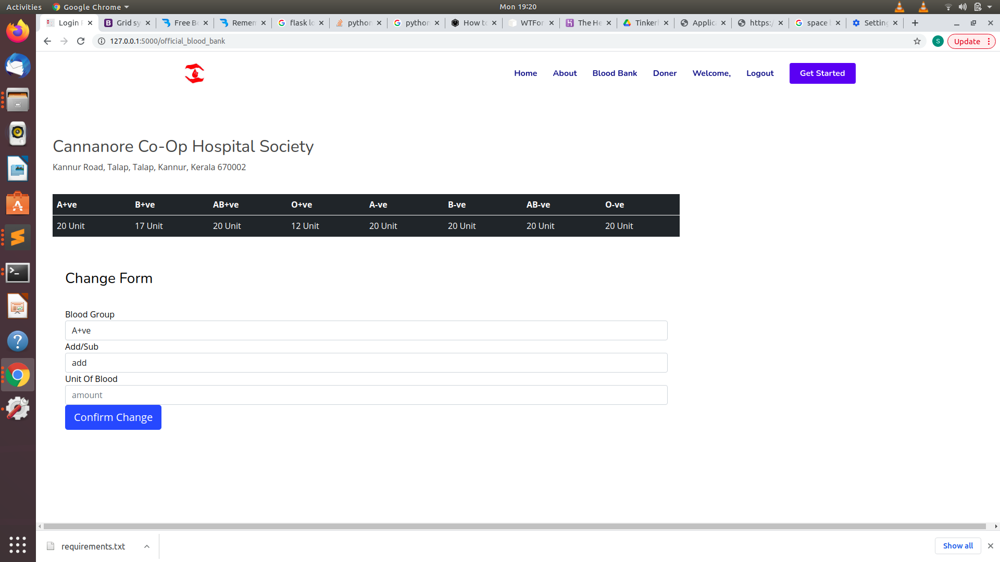

<<<<<<< HEAD
# Blood Donation
  It is a web application based blood monitoring system.

  Our project, Operation Red establishes a web application based blood bank monitoring system.

In the project we include 3 types of users. Blood banks, Receivers and Donors. Users should register into the site and create their own accounts. The users will be asked to fill up necessary details depending on which type of user they are (Blood Bank, receiver or donor).

Once registered, the users can login to their respective accounts and access the website. The site offers the following functionality to the users.

	1.Blood banks can automatically send notifications to the registered donors if the blood availability of any blood group falls short of the minimum required value.

	2.Receivers in urgent need of a particular blood group can directly contact the registered donors in the same district via mail simultaneously which increases the chance of successfully obtaining the required unit of blood.

	3.Donors can obtain information about the various blood banks near them and can contact them when they want to donate blood

---

#### Pre-requisites

1. Install `python3` on your device if not already by looking up the following docs([windows](https://www.python.org/downloads/windows/), [mac](https://www.python.org/downloads/mac-osx/), `ubuntu` comes pre-installed)
2. Install `virtualenv` if not already by running `pip3 install virtualenv`

---

#### Setup 

###### clone the repository
``
https://github.com/skuthoor/Blood_Donation.git
``
###### move to the cloned Directory
``
cd Blood_donation
``

#### Steps
##### For  Linux/MacOS

1. Setup a virtual env
2. Run `pip3 install -r requirements.txt` to install packages
3. Run `app.py` to start the server

---

##### For  Linux/MacOS

1. Setup a virtual env
2. Run `pip install -r requirements.txt` to install packages
3. Run `app.py` to start the server

---

### Images
=======

